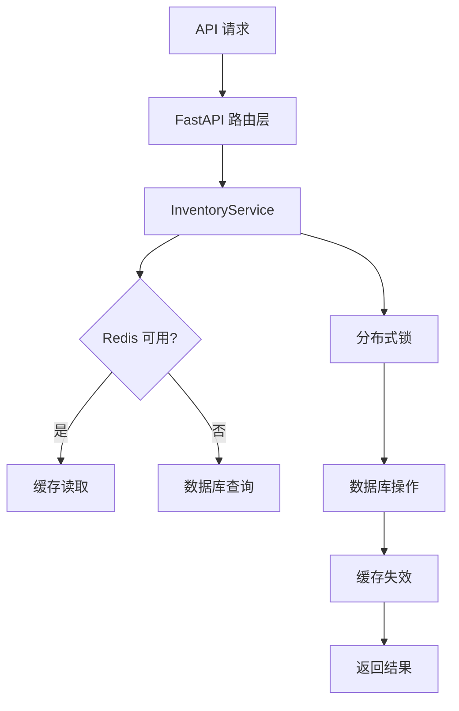

# FastAPI  库存微服务

一个专业的、生产级的库存微服务，支持高并发环境下的库存安全管理，防止超卖问题。

[](https://www.python.org/)
[](https://fastapi.tiangolo.com/)
[](LICENSE)

## 核心特性

- ✅ **防超卖保障** - PostgreSQL 行级锁 + Redis 分布式锁双重保护
- ✅ **高性能缓存** - Redis 缓存层加速读取，支持批量操作
- ✅ **多层架构** - API / Celery / CLI 三种调用方式
- ✅ **完整审计** - 详细的操作日志和状态追踪
- ✅ **幂等保证** - 基于 Redis 的请求去重机制
- ✅ **优雅降级** - Redis 故障时自动降级到数据库模式

## 快速开始

### 环境要求
- Python 3.8+
- Docker & Docker Compose
- PostgreSQL 15+
- Redis 7+

### 一、环境配置
```bash
# 克隆项目
git clone https://github.com/15087312/FastAPI.git
cd FastAPI_mall

# 创建环境变量
 cp .env.example .env

# 编辑 .env 文件配置数据库和 Redis 连接
```

### 二、启动基础服务
```bash
# 启动 PostgreSQL 和 Redis
docker compose up -d

# 验证服务状态
docker compose ps
```

### 三、安装依赖并启动应用
```bash
# 安装 Python 依赖
pip install -r requirements.txt

# 启动开发服务器
uvicorn app.main:app --reload
```

### 四、 访问应用
- **API 文档**: http://localhost:8000/docs
- **健康检查**: http://localhost:8000/
- **pgAdmin**: http://localhost:5050

## 🏗️ 项目架构

```bash
# 启动所有 Docker 服务（后台运行）
docker compose up -d

# 查看服务状态
docker compose ps

# 查看日志
docker compose logs redis  # 查看 Redis 日志
docker compose logs db     # 查看数据库日志

# 查看当前运行的容器
docker ps
```

**说明：**

- 如果容器不存在 → 会自动创建
- 如果容器已存在但停止 → 会自动启动  
- 如果容器已运行 → 不会重复创建



```bash
# 启动开发服务器（自动热重载）
uvicorn app.main:app --reload
```

**访问地址：**

- 应用主页：http://127.0.0.1:8000
- 接口文档（Swagger）：http://127.0.0.1:8000/docs

## 📚 文档资源

- [📘 技术文档](./技术文档.md) - 详细的架构设计和技术说明
- [📝 API 总览](./api总览.md) - 完整的接口文档
- [🎯 工作目标](./工作目标) - 项目规划和里程碑

```bash
# 停止容器（不删除数据）
docker compose down
```

**数据管理**

```bash
# 停止服务（保留数据）
docker compose down

# 停止并清除所有数据
docker compose down -v

# 备份数据库
docker compose exec db pg_dump -U postgres mydb > backup.sql

# 恢复数据库
docker compose exec -T db psql -U postgres mydb < backup.sql
```

## ⚡ 一键启动脚本

### Windows PowerShell
```powershell
# 创建 start.ps1
@'
docker compose up -d
uvicorn app.main:app --reload
'@ | Out-File -FilePath start.ps1 -Encoding UTF8

# 运行
./start.ps1
```

### Linux/macOS Bash
```bash
#!/bin/bash
# 创建 start.sh

docker compose up -d
uvicorn app.main:app --reload

chmod +x start.sh
./start.sh
```

在项目根目录创建 `start.ps1`：

```powershell
# 启动数据库等基础服务
docker compose up -d

# 启动 FastAPI 开发服务器
uvicorn app.main:app --reload
```

**运行：**

```bash
.\start.ps1
```

## 🛠️ 开发工作流

1. **启动环境**: `docker compose up -d`
2. **运行应用**: `uvicorn app.main:app --reload`
3. **开发调试**: 使用 Swagger UI 测试接口
4. **运行测试**: `python -m pytest tests/`
5. **停止服务**: `docker compose down`

1️⃣ `docker compose up -d`
2️⃣ `uvicorn app.main:app --reload` 
3️⃣ 开发接口
4️⃣ `docker compose down` （结束工作）

## 🔧 故障排除

### 服务状态检查
```bash
# 查看所有容器状态
docker compose ps

# 查看服务日志
docker compose logs db      # 数据库日志
docker compose logs redis   # Redis 日志

# 重启特定服务
docker compose restart db
docker compose restart redis
```

### 常见问题解决

**Redis 连接失败**
```bash
# 检查 Redis 服务
docker compose logs redis | grep -i error

# 重新创建 Redis 容器
docker compose down
docker compose up -d redis
```

**数据库连接超时**
```bash
# 检查数据库连接
docker compose exec db pg_isready

# 查看数据库日志
docker compose logs db | tail -20
```

**缓存数据不一致**
```bash
# 清理 Redis 缓存
docker compose exec redis redis-cli FLUSHALL

# 或重启 Redis 服务
docker compose restart redis
```

**查看容器状态：**
```bash
docker ps -a
```

**查看数据库日志：**
```bash
docker logs fastapi_db
```

**查看Redis日志：**
```bash
docker logs fastapi_redis
```

**重启特定服务：**
```bash
# 重启数据库
docker compose restart db

# 重启Redis
docker compose restart redis
```
## 📊 性能基准

| 操作类型 | QPS | 响应时间 | 缓存命中率 |
|---------|-----|---------|-----------|
| 单商品查询 | 5,000+ | <50ms | 90%+ |
| 批量查询(10个) | 2,000+ | <100ms | 85%+ |
| 库存预占 | 1,000+ | <200ms | N/A |
| 库存确认 | 1,500+ | <150ms | N/A |

## 🤝 贡献指南

欢迎提交 Issue 和 Pull Request！

### 开发规范
- 遵循 PEP 8 代码风格
- 添加必要的单元测试
- 更新相关文档
- 使用有意义的提交信息

### 本地开发
```bash
# 运行测试
python -m pytest tests/ -v

# 代码质量检查
flake8 app/
black app/

# 类型检查
mypy app/
```

## 📄 许可证

MIT License - 详见 [LICENSE](LICENSE) 文件

---

<p align="center">
  <strong>📦 专业的库存管理解决方案</strong>
</p>